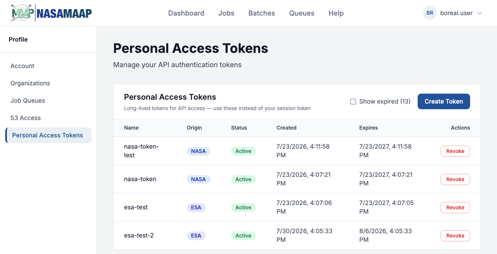
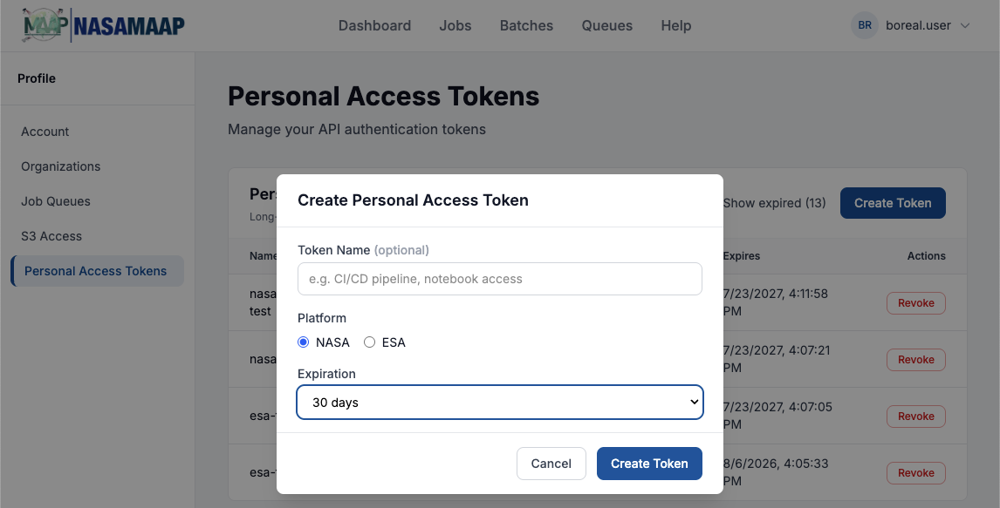

Personal Access Tokens
=======================================

Personal Access Tokens (PATs) are long-lived credentials you can use to
authenticate to the MAAP API from outside the MAAP Hub — for example, when
running ``maap-py`` on your local machine or from an automated script. A PAT
takes the place of the short-lived session token that the Hub manages for you
automatically, so you no longer need to copy a temporary token out of a running
workspace.

MAAP supports two kinds of tokens:

* **NASA** tokens authenticate to NASA MAAP resources.
* **ESA** tokens authenticate to ESA MAAP resources and are managed on ESA's
  gateway on your behalf (see :ref:`pat-nasa-esa`).

.. note::
   You do **not** need a Personal Access Token inside the MAAP Hub. Workspaces
   are authenticated automatically. PATs are only for programmatic access from
   outside the Hub.

Creating a token
----------------

The **Personal Access Tokens** tab in the MAAP Console lists your existing
tokens and is where you create new ones:

To create a token:

1. Sign in to the MAAP Console at https://console.maap-project.org.
2. Open the **Profile** area and select the **Personal Access Tokens** tab.
3. Click **Create Token** and choose:

   * **Token Name** *(optional)* — a label to help you recognize the token
     later (for example, ``laptop`` or ``ci-pipeline``).
   * **Platform** — **NASA** or **ESA**, depending on which resources the token
     will access.
   * **Expiration** — ``1 day``, ``7 days``, ``30 days``, ``90 days``, ``1 year``, or ``No expiration``.

4. Click **Create**. The token value is displayed **once** — copy it
   immediately and store it somewhere safe. You will not be able to view it
   again.

.. warning::
   Treat a Personal Access Token like a password. Anyone who has it can act as
   you against the MAAP API. Store it as an environment variable or in a secrets
   manager — never commit it to a Git repository or paste it into a shared
   notebook.

Using a token with maap-py
--------------------------

Outside the Hub, ``maap-py`` reads your token from the ``MAAP_PGT`` environment
variable. Set it to your Personal Access Token before initializing ``MAAP``:

.. code-block:: python

   import os
   os.environ["MAAP_PGT"] = "<your-personal-access-token>"

   from maap.maap import MAAP
   maap = MAAP()

   # maap-py now authenticates as you
   me = maap.profile.account_info()

Alternatively, export the variable in your shell before launching Python:

.. code-block:: bash

   export MAAP_PGT="<your-personal-access-token>"

.. _pat-nasa-esa:

NASA and ESA tokens
-------------------

MAAP is a joint NASA/ESA platform. When you create a token you choose which
platform it targets:

* A **NASA** token is stored and validated by NASA MAAP.
* An **ESA** token is created on, and validated by, the ESA MAAP gateway. NASA
  users can create and manage ESA tokens directly from the NASA MAAP Console —
  the Console proxies the request to ESA for you. ESA tokens are typically used
  as a ``Bearer`` token when accessing ESA-hosted data. For worked examples, see
  the ESA BIOMASS and ESA CCI data-access tutorials in the Science section.

Managing your tokens
---------------------

The **Personal Access Tokens** tab lists your tokens with their platform
(NASA/ESA), status, creation date, and expiration:

* **Revoke** — click *Revoke* on a token to invalidate it immediately. Any
  script still using that token will stop working.
* **Status** — a token is *Active*, *Expired* (past its expiration), or
  *Revoked*.
* **Show expired** — expired tokens are hidden by default. Toggle **Show
  expired** to display them.

.. note::
   Tokens are tied to your MAAP membership. If your account is suspended, your
   tokens will not authenticate until the account is reactivated. Create a new
   token whenever one expires — expired tokens cannot be renewed.
